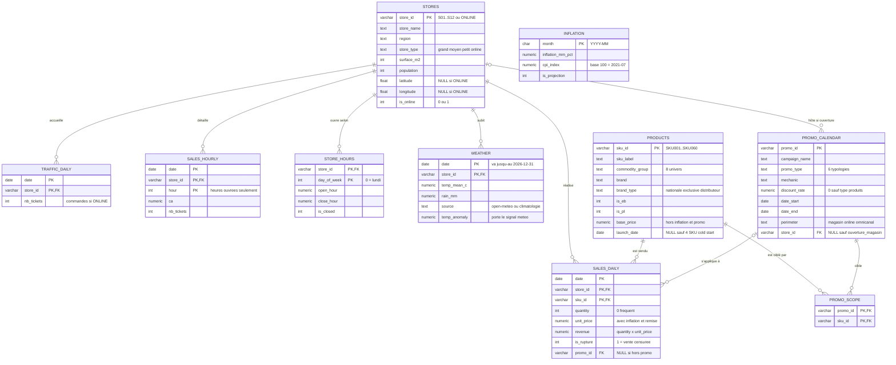
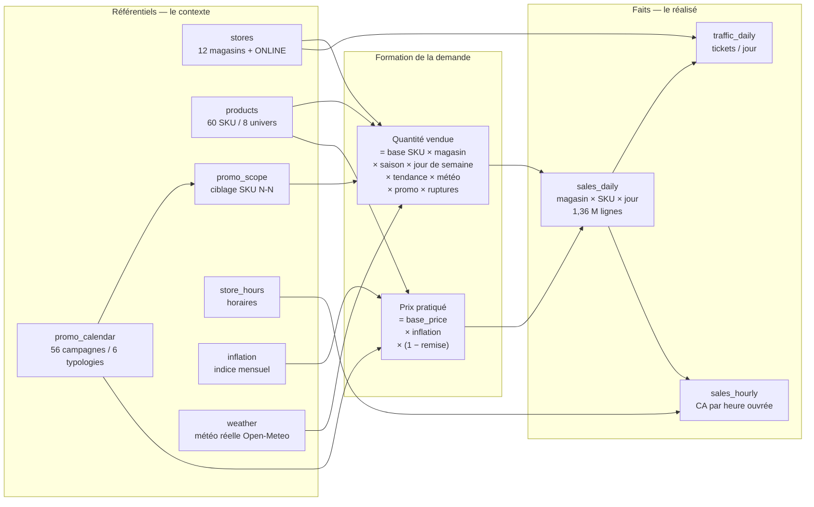

# Modèle de données

## MCD — modèle conceptuel

Étoile classique : une table de faits (`sales_daily`) au centre, entourée de ses
dimensions. Deux faits secondaires (`traffic_daily`, `sales_hourly`) partagent la
dimension magasin. La seule relation N-N est `promo_scope`, qui relie les
campagnes aux SKU qu'elles ciblent.

`INFLATION` n'a pas de clé étrangère : elle se joint sur le **mois** de la date
(`TO_CHAR(s.date, 'YYYY-MM') = i.month`).

---

## Schéma fonctionnel — comment la donnée est orchestrée

Lecture de gauche à droite : les référentiels décrivent le **contexte**
(qui vend, quoi, quand, sous quelle promo, par quel temps) ; ils alimentent la
génération de la **demande**, qui produit les tables de faits.

### Les signaux volontairement encodés

Le jeu n'est pas du bruit aléatoire : chaque mécanisme ci-dessous est **présent
et mesurable en SQL**. C'est ce qui rend les questions intéressantes — et ce qui
permet de vérifier qu'une réponse d'agent est juste plutôt que plausible.

| Mécanisme | Où le voir | Effet attendu |
|---|---|---|
| Saisonnalité hebdo | `sales_daily` × `stores` | samedi en magasin, dimanche en ligne |
| Saisonnalité annuelle | `sales_daily` × `products` | antiparasitaires l'été, oiseaux l'hiver, jouets à Noël |
| Jours fériés | `traffic_daily` | fermeture 1er mai / Noël / jour de l'an |
| Tendance | `sales_daily` par année | ONLINE ≈ +14 %/an, Dijon en léger déclin |
| Inflation | `unit_price` vs `base_price` | dérive des prix 2021-2023 |
| Promo `produits` | `promo_scope` + `promo_calendar` | uplift ≈ 1 + 2,2 × remise, puis creux |
| Promo `influence` | idem, type `influence` | pic décalé vers J+10, online |
| Promo `seuils` | `traffic_daily` | panier article dopé, pas les quantités |
| Météo | `weather.temp_anomaly` | canicule → trafic magasin −4,5 %/°C |
| Ruptures | `is_rupture` | ~1,1 % des lignes, ventes censurées |
| Cold start | `products.launch_date` | 4 SKU sans historique avant lancement |
